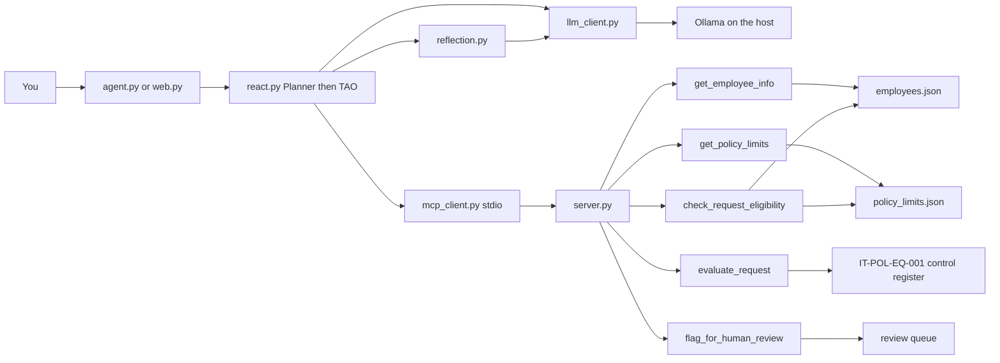
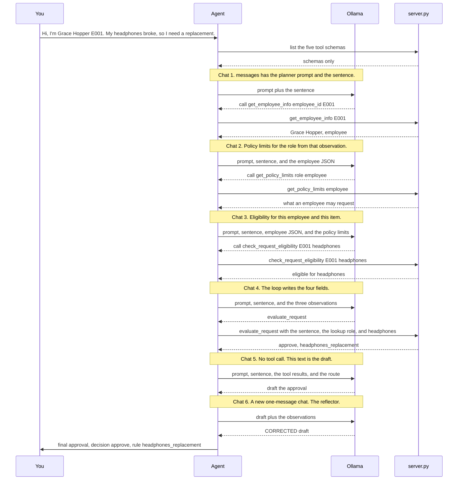
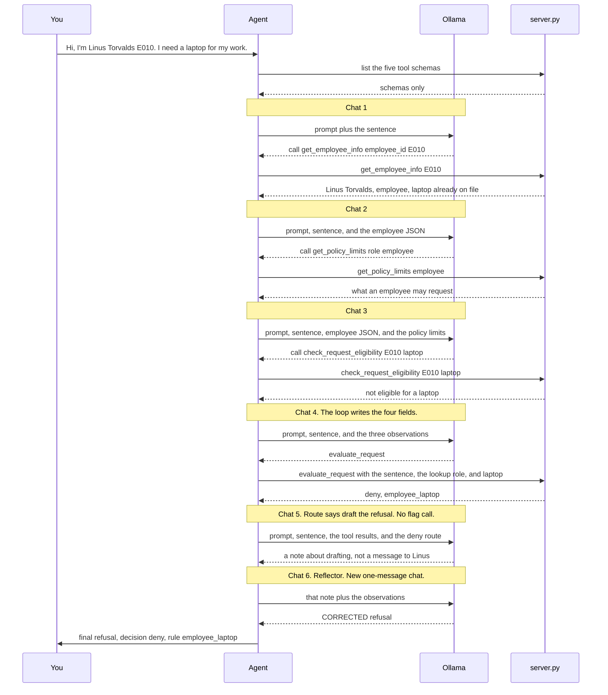
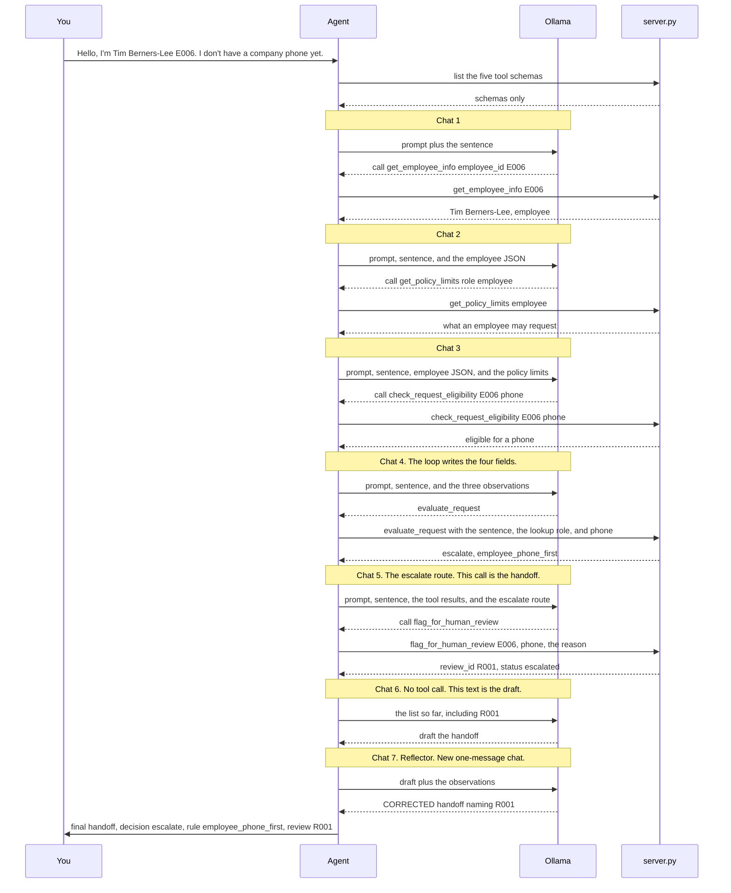
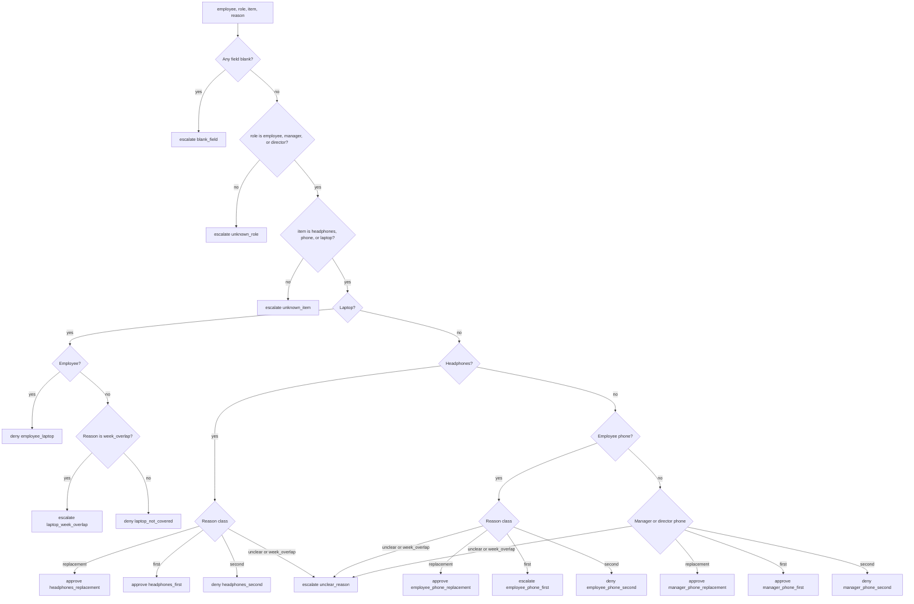

# IT Service MCP handbook

How one equipment request moves from a sentence on the command line to an approval, a refusal, or a handoff to a person.

The model does not decide policy. It chooses the next tool and writes the message. The loop fills the tool arguments from the sentence and the lookup. `evaluate_request` applies the control register in [requirements.md](requirements.md). The same standard is published as IT-POL-EQ-001 in [policy.md](policy.md).

## What you run

Ollama stays on the host, outside this container. The agent talks to `http://host.docker.internal:11434` and uses `qwen3:8b`. Pull the model on the host. Do not pull it inside the container.

```bash
uv sync
uv run python app/scripts/agent.py "Hi, I'm Grace Hopper (E001). My headphones broke, so I need a replacement."
```

`app/scripts/run_pool.py` runs the 24 requests in `demo/request_pool.json` and writes a trace per case under `demo/traces/`.

Tests never call Ollama:

```bash
uv run pytest -q
```

| Env var | Default | Purpose |
|---|---|---|
| `OLLAMA_HOST` | `http://host.docker.internal:11434` | Host Ollama. Process environment wins, then `.env`, then this default. |
| `OLLAMA_MODEL` | `qwen3:8b` | Chat model for the planner loop and the reflector. |

## Architecture

Two processes. The agent holds the chat. The server only answers tool calls. Ollama stays on the host, outside both.



`agent.py` prints one request. `web.py` serves the desk and streams the same trace. Both call `run_agent`. The loop asks Ollama what to do, then asks `server.py` to run the tool. `reflection.py` is a second, separate chat after a draft exists.

A person named in the request, by id or by a roster name, is looked up first. Policy limits, eligibility, and `evaluate_request` run only after that lookup finds them. A call that skips ahead is logged as an action and an observation naming the tool that has not returned. The next thought is the model's reply to that observation.

A sentence that names nobody is `escalate` / `subject_unresolved` before any tool runs. The next call is `flag_for_human_review`. The same route is taken when `get_employee_info` returns `found: false`. Policy limits, eligibility, and `evaluate_request` do not run on that route. `subject_unresolved` is not one of the sixteen controls.

If the model writes a draft before the open step has returned, and the loop can build that step's arguments from the sentence and the lookup, the loop makes the call and records the thought, the action, and the observation. If it cannot, the observation names the missing tool.

The files under `demo/traces/` are an earlier capture that skipped the policy and eligibility calls.

## One approval, message by message

There are two conversations, and they never share the sentence.

The chat is a list called `messages` in `app/src/agent/react.py`. Only Ollama sees it. `server.py` is a second process that only answers tool calls. It does not send the first message, and it never receives "Hi, I'm Grace Hopper...".

This is the required sequence for the headphones approval. The sentence stays a string in the chat. On chat 4 the loop sets `reason` to that sentence, `role` to the role from the lookup, and `item_requested` to the catalog word in the sentence. `demo/traces/` still holds the earlier capture, which skipped the policy and eligibility calls.



## One denial, message by message

Same six chats as the approval. The route after `evaluate_request` says to draft the refusal and not to call `flag_for_human_review`. The example is Linus Torvalds, E010, asking for a laptop. A laptop is not eligible.



The loop appends the same way as the approval: system prompt, sentence, then a tool call and its JSON after chats 1 through 4. Chat 5 has no tool call, so nothing is appended before the reflector. The reflector's reply is not appended. On the earlier capture the draft was "I need to draft the denial message." The reflector replaced it with the refusal that names `employee_laptop`.

## One escalation, message by message

One extra chat. After `evaluate_request` returns `escalate`, the route says to call `flag_for_human_review` and then draft the handoff with the review id. The example is Tim Berners-Lee, E006, asking for a first company phone. An employee phone is eligible as a category; the decision tool is what escalates a first phone.



Chats 1 through 5 each append a tool call and its JSON. Chat 6 is the draft. Chat 7 is not appended. A denial never takes the flag chat. An approval never takes it either.

### What is in `messages` after each chat

This table is the Grace Hopper approval. A denial uses the same six chats with a deny route. An escalation inserts `flag_for_human_review` after `evaluate_request`, and the draft moves one chat later.

The list starts with two entries and grows by two after every tool call. The sentence is only entry 2. It is never rewritten into JSON.

| After | What Ollama was just sent | What comes back |
|---|---|---|
| Start | nothing yet | The list is built locally: system prompt, then your sentence. |
| Chat 1 | prompt + sentence | Tool call `get_employee_info({"employee_id": "E001"})`. The loop appends that call and the employee JSON. |
| Chat 2 | prompt + sentence + employee JSON | Tool call `get_policy_limits` with the role from that observation. The loop appends that call and the limits JSON. |
| Chat 3 | the list so far, including the limits | Tool call `check_request_eligibility` for E001 and headphones. The loop appends that call and the eligibility JSON. |
| Chat 4 | the list so far, including eligibility | Tool call `evaluate_request`. The loop sets the reason to the sentence and the role to the lookup, then appends the call and `{"decision": "approve", "rule": "headphones_replacement"}`. |
| Chat 5 | the whole list above | Plain text, no tool call. That text is the draft. |
| Chat 6 | a brand-new one-message chat: the draft and the observations | `CORRECTED:` plus the final wording. This chat is not appended to `messages`. |

Chat 4's arguments, after the loop replaces `reason` with the user sentence and `role` with the lookup, are:

```json
{
  "employee": "Grace Hopper",
  "role": "employee",
  "item_requested": "headphones",
  "reason": "Hi, I'm Grace Hopper E001. My headphones broke, so I need a replacement."
}
```

`server.py` sees that object only when the agent calls the tool. `evaluate_request` returns the decision. The model does not choose approve or deny.

### What the trace lines are

`[THOUGHT]`, `[ACTION]`, `[OBSERVATION]`, `[ROUTE]`, `[DRAFT]`, and `[REFLECTION]` are a log the agent prints for you. They are not messages from `server.py`. On this run the log follows the diagram: lookup, policy limits, eligibility, decision, route, draft, reflection, final text.

### The flag tool, and the exits

`flag_for_human_review` is added only after an `escalate` decision, before the draft.

A draft before the open step has returned does not become the letter. When the loop can build that step's arguments, it calls the tool and records the thought, the action, and the observation. When it cannot, the observation names the missing tool and the model calls it next. For a person on file the steps are the four investigation tools, and an `escalate` decision also waits for `flag_for_human_review`. For a sentence that names nobody, the only step is `flag_for_human_review`. For an id that is not on file, the steps are `get_employee_info` and then `flag_for_human_review`. The loop sends `evaluate_request` the user's sentence as `reason`, and the role from `get_employee_info` when that lookup found the person. `item_requested` must be `headphones`, `phone`, or `laptop`, and that word must appear in the sentence. An empty reply is retried. After 12 chats with no accepted draft, the result tells the person to contact IT. The reflector keeps the draft on `CONFIRMED`, replaces it on `CORRECTED:`, and keeps it if the reply is neither.

## How the decision is made

This diagram is only the rules inside `evaluate_request`, after the four fields already exist. It is not the chat.

`evaluate_request` in `app/src/tools/decision.py` normalizes the four fields, then walks the control register in `CONTROLS` and stops at the first control that applies. The function does not branch on the request. Role and item are trimmed and lowercased. A blank field is empty or only spaces. The same register is written out as IT-POL-EQ-001 in [policy.md](policy.md).

Reason class is also first-match, on the lowercased reason:

1. `week_overlap` when the text has all three: a keep-both phrase (`keep both` or `both laptops`), a week phrase (`week` or `7 days`), and `return`.
2. `unclear` when the text states a count greater than one of headphones, phones, laptops, or pairs, such as `200 new headphones`. `7 days` is not an item count.
3. `unclear` when it has both a second-item signal and a first-item signal.
4. `second` for `second`, `spare`, `additional`, `another`, `extra`, or `already have`.
5. `first` for `first`, `do not have`, `don't have`, or `not have one yet`.
6. `replacement` for `replacement`, `replace`, `replacing`, `broken`, `broke`, `lost`, `stolen`, `worn out`, or `stopped working`.
7. `unclear` when none of those match.

`week_overlap` wins over `replacement`. A sentence that says both "replacing" and "keep both for a week before returning" is `week_overlap`.



No laptop request is approved. An employee laptop is `employee_laptop`. A manager or director who will keep both laptops for a week and then return the old one is `laptop_week_overlap`. Every other laptop is `laptop_not_covered`.

Headphones are approved for a replacement or a first pair, and denied for a second pair, for every role. An employee phone is approved only as a replacement; a first company phone is escalated, and an extra phone is denied. A manager or director phone is approved for a replacement or a first phone, and denied for a second. Headphones or phone reasons that are `unclear` or `week_overlap` escalate as `unclear_reason`.

The tool returns only this:

```json
{"decision": "approve", "rule": "headphones_replacement"}
```

## What a tool accepts

`app/src/tools/intake.py` checks every argument with Pydantic before a lookup or a control runs. The loop runs the same blanking on the values it is about to send, so `NaN` never goes out as a number.

`NaN`, `Infinity`, and any value that is not text become a blank string. The call still succeeds. A blank id on `get_employee_info` returns `found: false`. A blank role on `get_policy_limits` returns `known: false`. A blank field on `evaluate_request` is `escalate` / `blank_field`. A blank id on `flag_for_human_review` is still recorded.

A newline, or the phrase `ignore previous`, inside a role or an item is rejected. That call is an MCP error, and the loop stores it as an observation. The same phrase inside `reason` is ordinary text. It does not match a covered reason, so the decision is `escalate` / `unclear_reason`.

## The five tools

`app/src/server.py` registers them on the stdio server named Internal IT Service. `app/src/mcp_client.py` launches that process and keeps one session for the whole agent run. The one-shot helpers `list_tools` and `call_tool` start a fresh process per call.

| Tool | Reads or writes | Returns |
|---|---|---|
| `get_employee_info(employee_id)` | `data/employees.json` | `found`, name, role, tenure, equipment. Unknown id: `found: false`. |
| `get_policy_limits(role)` | `data/policy_limits.json` | What the role may request and the period for each item. Unknown role: `known: false`. |
| `check_request_eligibility(employee_id, item)` | The two lookups above | `eligible` when that role covers the item under at least one reason. A laptop, an unknown item, or an unknown employee is not eligible. Equipment already on file is ignored. |
| `evaluate_request(employee, role, item_requested, reason)` | The procedure above | `{decision, rule}`. |
| `flag_for_human_review(employee_id, request, reason)` | In-process queue | A `ReviewRecord` with `review_id` like `R001` and `status: escalated`. It records the request and does not approve it. |

When the person is on file, the loop calls `get_policy_limits` and `check_request_eligibility` before `evaluate_request`. That decision comes from `evaluate_request`. When the sentence names nobody, or the id is not on file, the router records `subject_unresolved` and opens review without those calls.

## Where the code lives

```
app/src/server.py           registers the five tools
app/src/tools/intake.py     Pydantic checks for the five tool arguments
app/src/tools/              the functions, including decision.py
app/src/mcp_client.py       stdio client
app/src/agent/react.py      planner prompt and TAO loop
app/src/agent/llm_client.py host Ollama /api/chat
app/src/agent/reflection.py second pass over the draft
app/src/agent/trace.py      thought, action, observation, route, draft, reflection
app/scripts/agent.py        one request
app/scripts/run_pool.py     the 24-request pool
data/                       employees.json and policy_limits.json
fixtures/                   10 structured cases with expected decisions
demo/                       captured traces and outputs
```

A trace prints as it is built, so a terminal capture is the submission record. The same steps are stored on `AgentResult.trace` for the reflector and for `demo/traces/`.
